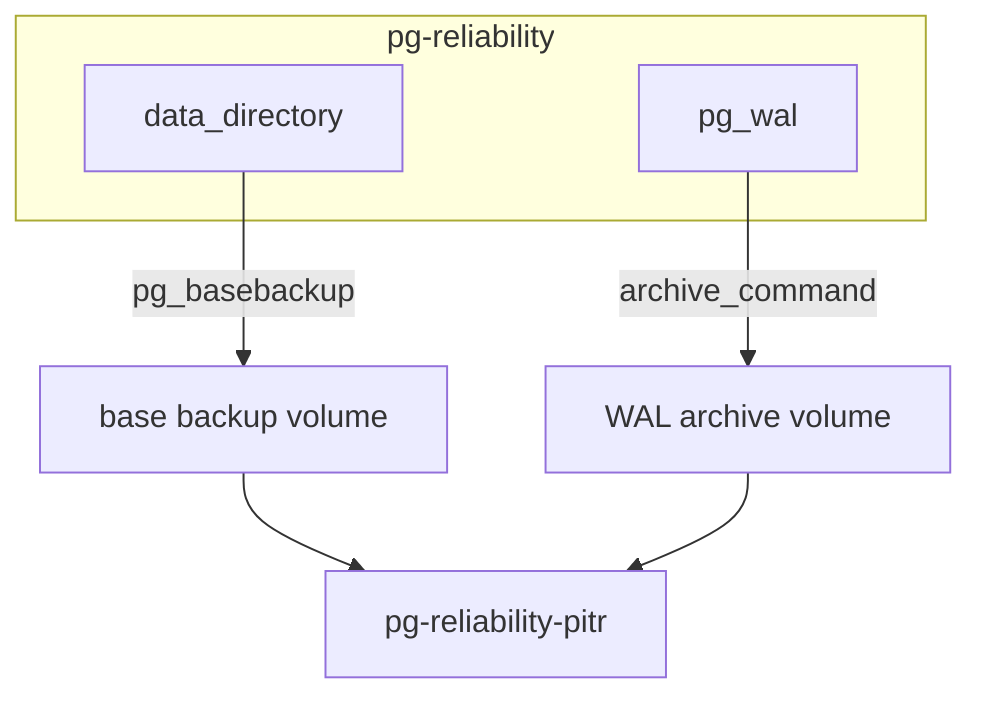

# PostgreSQL 信頼性デモ（WAL / Crash Recovery / PITR）

講義デモ用。シングルインスタンスで WAL の記録、クラッシュ後の自動復旧、PITR による誤操作からの復旧を step by step で見せる。

**Docker Compose YAML は用意していません。** 本デモは段階理解のため `docker run` と各 Phase 用シェルスクリプト（`scripts/`）で構成しています。

詳細手順は [outline/detail/20260907_JSSST_detail_part1_rdb.md](../../../outline/detail/20260907_JSSST_detail_part1_rdb.md) の「デモ > 信頼性・耐久性」も参照。

## 構成

| 要素 | 値 |
|------|-----|
| PostgreSQL イメージ | `postgres:18`（データ volume は `/var/lib/postgresql`。実体は `/var/lib/postgresql/18/docker`） |
| 本番デモ用コンテナ | `pg-reliability`（ホスト `localhost:5434`） |
| PITR 復元用コンテナ | `pg-reliability-pitr`（ホスト `localhost:5435`） |
| データ volume | `pg-reliability-data` |
| PITR 復元 volume | `pg-reliability-pitr-data` |
| WAL アーカイブ volume | `pg-wal-archive` |
| ベースバックアップ volume | `pg-basebackup` |



## 前提

- Docker が利用可能であること
- 可用性デモ（`postgres-availability`）と同時に使う場合はポート `5434` / `5435` が空いていること
- Windows では [WSL2 + Docker Desktop](../../WINDOWS.md) 上で実行する（PowerShell から `.sh` は実行しない）

## Phase 0: 事前準備

```bash
./scripts/00-preflight.sh
```

## Phase 1: シングルインスタンス起動

**目的**: PostgreSQL 1 台を起動し、WAL archiving を有効化する（PITR の前提）。

- `/archive` と `/backup` を mount して起動
- `archive_mode=on`, `archive_command` を設定
- `demo_items` 表を作成

```bash
docker run -d --name pg-reliability \
  -e POSTGRES_PASSWORD=postgres \
  -p 5434:5432 \
  -v pg-reliability-data:/var/lib/postgresql \
  -v pg-wal-archive:/archive \
  -v pg-basebackup:/backup \
  postgres:18
```

```sql
ALTER SYSTEM SET wal_level TO 'replica';
ALTER SYSTEM SET archive_mode TO 'on';
ALTER SYSTEM SET archive_command TO 'test ! -f /archive/%f && cp %p /archive/%f';
```

```bash
docker restart pg-reliability
```

```sql
CREATE TABLE IF NOT EXISTS demo_items (
  id serial PRIMARY KEY,
  name text,
  created_at timestamptz DEFAULT now()
);
INSERT INTO demo_items (name)
SELECT 'initial'
WHERE NOT EXISTS (SELECT 1 FROM demo_items WHERE name = 'initial');

SHOW archive_mode;
SHOW wal_level;
SELECT * FROM demo_items ORDER BY id;
```

**見せること**: 単一インスタンスで archiving が有効になり、以降の WAL が `/archive` に残る。

```bash
./scripts/01-start-instance.sh
```

## Phase 2: WAL の確認

**目的**: 更新が WAL に記録されることを見せる。

```sql
SELECT pg_current_wal_lsn();
INSERT INTO demo_items (name) VALUES ('after_wal_demo');
SELECT pg_current_wal_lsn();
```

`pg_wal/` 配下の WAL ファイル（`/var/lib/postgresql/18/docker/pg_wal`）も確認する。

**見せること**: INSERT の前後で LSN が進み、更新が WAL に載ること。

```bash
./scripts/02-verify-wal.sh
```

## Phase 3: Crash Recovery

**目的**: 異常停止後、コミット済みデータだけが復元されることを見せる。

```sql
INSERT INTO demo_items (name) VALUES ('committed_before_crash');

BEGIN;
INSERT INTO demo_items (name) VALUES ('uncommitted_before_crash');
SELECT pg_sleep(120);
```

未コミット側はバックグラウンドで動かしたあと:

```bash
docker kill -s KILL pg-reliability
docker start pg-reliability
```

```sql
SELECT * FROM demo_items WHERE name LIKE '%crash%' ORDER BY id;
```

**見せること**: 再起動後の recovery ログと、コミット済み行だけが残ること（未コミットは消える）。

```bash
./scripts/03-crash-recovery.sh
```

## Phase 4: WAL archiving の確認

**目的**: WAL が `/archive` に退避されていることを確認する。

```sql
SELECT pg_switch_wal();
SELECT archived_count, last_archived_wal, failed_count, last_failed_wal
FROM pg_stat_archiver;
```

ホスト側では `/archive` volume 内のファイルも見る。

**見せること**: スイッチした WAL がアーカイブされ、PITR の材料が溜まっていること。

```bash
./scripts/04-verify-archiving.sh
```

## Phase 5: ベースバックアップ

**目的**: PITR の復元起点を取得し、復元目標時刻の手前データを投入する。

```bash
docker exec -u postgres pg-reliability pg_basebackup -D /backup -Fp -Xs
```

```sql
INSERT INTO demo_items (name) VALUES ('before_mistake_1');
INSERT INTO demo_items (name) VALUES ('before_mistake_2');
SELECT clock_timestamp();
SELECT pg_switch_wal();
```

復元目標時刻はスクリプトが `.recovery_target_time` に保存する。

**見せること**: ベースバックアップのあと、まだ消していない「戻したい行」と、その直後の時刻が揃うこと。

```bash
./scripts/05-basebackup.sh
```

## Phase 6: PITR

**目的**: 誤 DELETE 後、指定時刻まで戻してデータを取り戻す。

```sql
DELETE FROM demo_items WHERE name LIKE 'before_mistake_%';
SELECT * FROM demo_items WHERE name LIKE 'before_mistake_%';  -- 本番側は空
SELECT pg_switch_wal();
```

ベースバックアップを PITR 用 volume にコピーし、`recovery.signal` と `postgresql.auto.conf` を置く:

```
restore_command = 'cp /archive/%f %p'
recovery_target_time = '<Phase 5 で保存した時刻>'
recovery_target_action = 'promote'
```

```bash
docker run -d --name pg-reliability-pitr \
  -p 5435:5432 \
  -v pg-reliability-pitr-data:/var/lib/postgresql \
  -v pg-wal-archive:/archive:ro \
  postgres:18
```

```sql
-- pg-reliability-pitr
SELECT * FROM demo_items WHERE name LIKE 'before_mistake_%' ORDER BY id;
```

**見せること**: 本番の DELETE 後でも、指定時刻までの REPLAY で削除前の行が戻ること。

```bash
./scripts/06-pitr.sh
```

## クリーンアップ

```bash
./scripts/cleanup.sh
```

## つまずきやすい点

1. **postgres:18 の volume**: `/var/lib/postgresql/data` に載せると起動時にエラー。`/var/lib/postgresql` に載せる。PITR 用にコピーした data dir は `postgres` uid の所有にする
2. **`/archive` と `/backup` の権限**: 公式イメージの VOLUME 外なので root 所有のままになる。archiver / `pg_basebackup` は uid 999 で動くため、起動後に `chown postgres` する（`01-start-instance.sh` が実施）
3. **archive volume**: Phase 1 から mount しておかないと Phase 6 の PITR ができない
4. **recovery_target_time**: 誤操作より前・対象 INSERT より後の時刻を指定する。PG12 以降は `recovery.conf` ではなく `recovery.signal` + `postgresql.auto.conf`（`restore_command` / `recovery_target_action`）
5. **base backup と WAL**: バックアップ後に発生した WAL がアーカイブされている必要がある。確認は `pg_stat_archiver`（`archived_count` / `last_failed_wal`）
6. **ポート**: 可用性デモ（5432/5433）と競合しないよう 5434/5435 を使用
7. **クラッシュ再現**: `docker kill -9` は CLI が `-9` をフラグと解釈することがある。`docker kill -s KILL` を使う

## デモ時間の目安

| Phase | 内容 | 目安 |
|-------|------|------|
| 1 | 起動 + archiving 設定 | 5 分 |
| 2 | WAL | 5 分 |
| 3 | Crash Recovery | 5–8 分 |
| 4–5 | archiving 確認 + basebackup | 8–10 分 |
| 6 | PITR | 10–15 分 |

合計 30–40 分（説明込み）。
