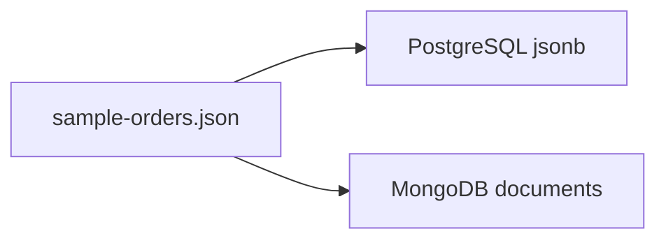

# PostgreSQL jsonb vs MongoDB：同じ JSON の格納・取出デモ

講義デモ用。**同一の注文 JSON** を PostgreSQL（`jsonb`）と MongoDB（ドキュメント）の両方に入れ、格納・検索・更新・スキーマ追加時の**使い勝手の差**を並べて確認する。

**Docker Compose YAML は用意していません。** 既存デモと同様、`docker run` と Phase 用スクリプトで進めます。

詳細は [outline/detail/20260907_JSSST_detail_part1_rdb.md](../../../outline/detail/20260907_JSSST_detail_part1_rdb.md) / [part2](../../../outline/detail/20260907_JSSST_detail_part2_nosql.md) の機能要件・デモ節も参照。

## 構成

| 要素 | 値 |
|------|-----|
| ネットワーク | `json-compare-net` |
| PostgreSQL | コンテナ `json-pg` / イメージ `postgres:18` / ホスト `localhost:15432` |
| MongoDB | コンテナ `json-mongo` / イメージ `mongo:8` / ホスト `localhost:27027` |
| サンプルデータ | [`data/sample-orders.json`](data/sample-orders.json)（注文 3 件） |
| PG DB / 表 | `json_demo.orders`（`doc jsonb`） |
| Mongo DB / コレクション | `json_demo.orders` |

ポートは他デモ（`5432` / `27017`）とぶつからない値にしています。



## デモで見せたいこと

1. **格納**: Postgres は表定義が先、Mongo は insert でコレクションが生まれる
2. **取出**: 同じ条件（ネスト／配列）を `->`/`@>` とドット記法でどう書くか
3. **更新**: `jsonb_set` と `$set` / `arrayFilters` の書き味の差（特に配列要素）
4. **スキーマ追加**: どちらも新キーを追加格納できるが、第一級が「行+jsonb」か「ドキュメント」かの違い

## 前提

- Docker が利用可能であること
- Windows では [WSL2 + Docker Desktop](../../WINDOWS.md) 上で実行する（PowerShell から `.sh` は実行しない）

## 講義での見せ方

各 Phase は **目的 → 実際のコマンド（SQL / docker / JS）→ 見せること → 実行スクリプト** の順。
講義では下のコマンドブロックを見せ、スクリプトはそのコマンドを順番に流す。

一括実行する場合:

```bash
cd demo/part2/json-postgres-vs-mongo
chmod +x scripts/*.sh
./scripts/run-all.sh
# 終了後
./scripts/cleanup.sh
```

---

## Phase 1: 起動

**目的**: 同じ JSON を載せる器として、PostgreSQL と MongoDB を 1 台ずつ立てる。

```bash
docker run -d --name json-pg --network json-compare-net \
  -e POSTGRES_PASSWORD=postgres \
  -e POSTGRES_DB=json_demo \
  -p 15432:5432 \
  postgres:18

docker run -d --name json-mongo --network json-compare-net \
  -p 27027:27017 \
  mongo:8
```

**見せること**: `json-pg` は `localhost:15432`、`json-mongo` は `localhost:27027`。他デモの `5432` / `27017` とぶつからない。

```bash
./scripts/00-preflight.sh
./scripts/01-start.sh
```

---

## Phase 2: 同じ JSON を格納

**目的**: 同一の `sample-orders.json` を両側に入れ、格納前の準備の差を見せる。

PostgreSQL は表定義が先（`jsonb` 列と生成列、GIN 索引）:

```sql
CREATE TABLE orders (
  id         bigserial PRIMARY KEY,
  order_id   text GENERATED ALWAYS AS (doc->>'order_id') STORED,
  doc        jsonb NOT NULL
);
CREATE UNIQUE INDEX orders_order_id_uidx ON orders (order_id);
CREATE INDEX orders_doc_gin ON orders USING gin (doc);
```

MongoDB は `CREATE TABLE` 相当なし。`mongoimport` した瞬間にコレクションができる:

```bash
mongoimport --db json_demo --collection orders \
  --file /tmp/sample-orders.json --jsonArray
```

**見せること**:

| 観点 | PostgreSQL (`jsonb`) | MongoDB |
|------|----------------------|---------|
| 器の用意 | `CREATE TABLE`（列型の決定）が必要 | 不要（コレクションは暗黙） |
| 1 件の単位 | 行 + jsonb 列（＋任意の生成列） | ドキュメントそのもの |
| 同じ JSON | `INSERT ... jsonb` | `insertMany` / `mongoimport` |
| 索引 | GIN on jsonb / 生成列の B-tree | フィールドパスへ `createIndex` |

```bash
./scripts/02-insert.sh
```

---

## Phase 3: 同じ条件で取り出す

**目的**: ネスト／配列の同じ条件を、SQL の jsonb 演算子と Mongo のドット記法で並べる。

### ケース A: `customer.email` で 1 件

```sql
SELECT order_id, doc #>> '{customer,name}' AS customer_name
FROM orders
WHERE doc #>> '{customer,email}' = 'sato@example.com';
```

```javascript
db.orders.find(
  { 'customer.email': 'sato@example.com' },
  { _id: 0, order_id: 1, 'customer.name': 1 }
)
```

### ケース B: 配列 `items.sku = BOOK-2`

```sql
SELECT order_id
FROM orders
WHERE doc @> '{"items":[{"sku":"BOOK-2"}]}'::jsonb
ORDER BY order_id;
```

```javascript
db.orders.find(
  { 'items.sku': 'BOOK-2' },
  { _id: 0, order_id: 1 }
)
```

### ケース C: `status=paid` かつ `tier=gold`

```sql
SELECT order_id, doc->>'status' AS status, doc #>> '{customer,tier}' AS tier
FROM orders
WHERE doc->>'status' = 'paid'
  AND doc #>> '{customer,tier}' = 'gold';
```

```javascript
db.orders.find(
  { status: 'paid', 'customer.tier': 'gold' },
  { _id: 0, order_id: 1, status: 1, 'customer.tier': 1 }
)
```

### ケース D: 名前と明細件数へのプロジェクション

```sql
SELECT order_id,
       doc->'customer'->>'name' AS name,
       jsonb_array_length(doc->'items') AS item_count
FROM orders;
```

```javascript
db.orders.aggregate([
  { $project: {
      _id: 0,
      order_id: 1,
      name: '$customer.name',
      item_count: { $size: '$items' }
  }}
])
```

**見せること**:

| 観点 | PostgreSQL (`jsonb`) | MongoDB |
|------|----------------------|---------|
| ネスト参照 | `->` / `->>` / `#>>` | ドット記法 `'customer.email'` |
| 配列内マッチ | `@>` や `jsonb_path_query` | `'items.sku': value` |
| 複合条件 | SQL の AND/OR | フィルタ文書の並記 / `$and` |
| 返す形 | SELECT リストで組み立て | projection / `$project` |

```bash
./scripts/03-query.sh
```

---

## Phase 4: ネスト／配列の部分更新

**目的**: 同じ変更を両側で行い、とくに配列要素の更新の書き味の差を見せる。

顧客名だけ変える（`ORD-1001` の `customer.name`）:

```sql
UPDATE orders
SET doc = jsonb_set(doc, '{customer,name}', '"Sato H."'::jsonb, true)
WHERE order_id = 'ORD-1001';
```

```javascript
db.orders.updateOne(
  { order_id: 'ORD-1001' },
  { $set: { 'customer.name': 'Sato H.' } }
)
```

配列要素の数量を増やす（`ORD-1002` の `BOOK-2` の `qty` を +1）:

```sql
WITH updated AS (
  SELECT order_id,
         jsonb_agg(
           CASE
             WHEN elem->>'sku' = 'BOOK-2'
               THEN jsonb_set(elem, '{qty}', to_jsonb((elem->>'qty')::int + 1))
             ELSE elem
           END
           ORDER BY ordinality
         ) AS new_items
  FROM orders,
       jsonb_array_elements(doc->'items') WITH ORDINALITY AS t(elem, ordinality)
  WHERE order_id = 'ORD-1002'
  GROUP BY order_id
)
UPDATE orders o
SET doc = jsonb_set(o.doc, '{items}', u.new_items)
FROM updated u
WHERE o.order_id = u.order_id;
```

```javascript
db.orders.updateOne(
  { order_id: 'ORD-1002' },
  { $inc: { 'items.$[it].qty': 1 } },
  { arrayFilters: [ { 'it.sku': 'BOOK-2' } ] }
)
```

**見せること**:

| 観点 | PostgreSQL (`jsonb`) | MongoDB |
|------|----------------------|---------|
| 単純なネスト更新 | `jsonb_set(doc, path, value)` | `$set: { 'a.b': value }` |
| 配列要素の部分更新 | SQL で展開・再集約が必要なことが多い | `$inc` + `arrayFilters` などが用意されている |
| 書き味 | 「行の jsonb 列を関数で書き換える」 | 「ドキュメント内のパスを直接更新する」 |

```bash
./scripts/04-update.sh
```

---

## Phase 5: 後からフィールドが増えた JSON

**目的**: `shipping` キー付きの新しい注文を、`ALTER TABLE` なしで両側に追加できることを見せる。第一級が「行 + jsonb」か「ドキュメント」かの違いを残す。

```sql
INSERT INTO orders (doc) VALUES ('{ ..., "shipping": { "carrier": "Yamato" } }'::jsonb);
SELECT order_id FROM orders WHERE doc ? 'shipping';
```

```javascript
db.orders.insertOne({ ..., shipping: { carrier: 'Yamato' } })
db.orders.find({ shipping: { $exists: true } }, { _id: 0, order_id: 1 })
```

**見せること**:

- どちらも「後からキーが増えた JSON」を追加格納できる（厳密スキーマ強制なし）
- PostgreSQL: 周囲は表・型・SQL。jsonb は「列の中の半構造」。生成列・CHECK で段階的に厳しくできる
- MongoDB: ドキュメントが第一級。アプリのオブジェクトとそのまま近い

```bash
./scripts/05-schema-flex.sh
```

---

## クリーンアップ

```bash
./scripts/cleanup.sh
```

## 講義でのまとめ（短く）

| 観点 | PostgreSQL `jsonb` | MongoDB |
|------|--------------------|---------|
| 位置づけ | RDB の列として JSON を載せる | ドキュメントが第一級 |
| 格納前準備 | 表・型の定義が必要 | ほぼ不要 |
| クエリ言語 | SQL + jsonb 演算子 | フィルタ／Aggregation 文書 |
| 配列の部分更新 | SQL で組み立てることが多い | 更新演算子が文書向け |
| 既存 SQL・結合・制約 | 混ぜやすい | 別モデル（`$lookup` 等） |

「RDB が JSON を扱える」ことと「ドキュメント DB の使い勝手」は近いようで異なり、同じ JSON を両方に載せると比較がはっきりする、というのが本デモの意図です。
