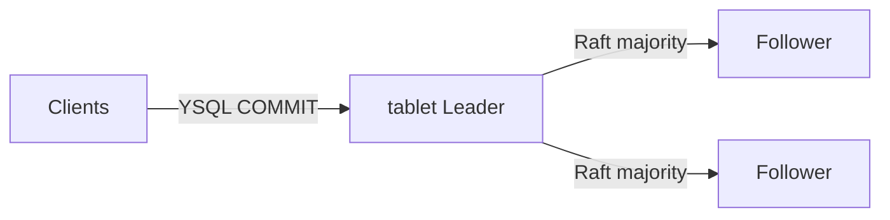

# YugabyteDB 可用性・信頼性デモ（Raft / tablet Leader / Failover）

講義デモ用。`yugabyted` 3 ノード universe（RF=3）をコンテナで構成し、tablet Leader の **ネットワーク分断**と **tserver kill** を通して、**COMMIT＝Raft 多数派合意**のためコミット済み行が残ることを見せる。

Part2 MongoDB デモ（`w:1` + `readConcern: local` の欠落 vs `w:majority` + `readConcern: majority`）との対比が主眼。YugabyteDB 上で Mongo の `w:1` 相当の損失パスを無理に再現しない。

**Docker Compose YAML は用意していません。** PostgreSQL / Mongo デモと同様、`docker run` と Phase 用スクリプトで段階的に進めます。

詳細は [outline/detail/20260907_JSSST_detail_part3_newsql.md](../../../outline/detail/20260907_JSSST_detail_part3_newsql.md) の Part3「(d) デモ」も参照。

## 前提

- Docker が利用可能であること（3 ノードで空きメモリ目安 5.5GB+）
- Windows では [WSL2 + Docker Desktop](../../WINDOWS.md) 上で実行する（PowerShell から `.sh` は実行しない）

## 構成

| 要素 | 値 |
|------|-----|
| イメージ | `yugabytedb/yugabyte:2024.2.2.1-b6`（`common.env` の `YB_IMAGE`） |
| ネットワーク | `yb-demo-net` |
| ノード | `yb1` / `yb2` / `yb3`（`yugabyted`、join で universe を形成） |
| YSQL ホストポート | `5433` / `5434` / `5435`（PG デモの 5432 と衝突回避） |
| Master UI（任意） | `7001` / `7002` / `7003` |
| TServer UI（任意） | `9001` / `9002` / `9003` |
| DB / 表 | `yugabyte.demo_writes` |
| メモリ目安 | **約 2GB × 3 ノード**（空きメモリ合計の目安 5.5GB+。`00-preflight` で警告） |



## デモで見せたいこと

1. 3 ノード universe・RF=3・YSQL で書き込み可能であること
2. tablet Leader 相当ノードを分断／停止すると、多数派側で **自動 Leader 選出**し書き込みが継続すること
3. 障害中に **COMMIT 済み**の行が生き残り、Mongo の `w:1` 欠落と対比できること
4. （任意）複数 tablet をまたぐトランザクション: 表ごとに tablet Leader があり、片方の Leader 障害でも部分コミットしないこと

## 講義での見せ方

各 Phase は **目的 → 実際のコマンド（SQL / docker）→ 見せること → 実行スクリプト** の順。
講義では下のコマンドブロックを見せ、スクリプトはそのコマンドを順番に流す。
隠しクライアントの連続 INSERT や probe 用 SQL は講義では出さない。

YSQL はコンテナ名へ接続する（`localhost` ではない）。プロセスは advertise 先で待ち受ける。

---

## Phase 1: クラスタ起動

**目的**: `yugabyted` 3 台を join して universe を作り、RF=3 の配置にする。

```bash
docker run -d --name yb1 --hostname yb1 --network yb-demo-net \
  -p 5433:5433 -p 7001:7000 -p 9001:9000 \
  yugabytedb/yugabyte:2024.2.2.1-b6 \
  bin/yugabyted start --base_dir=/home/yugabyte/yb_data --background=false

docker run -d --name yb2 --hostname yb2 --network yb-demo-net \
  -p 5434:5433 -p 7002:7000 -p 9002:9000 \
  yugabytedb/yugabyte:2024.2.2.1-b6 \
  bin/yugabyted start --base_dir=/home/yugabyte/yb_data --background=false \
  --join=yb1

docker run -d --name yb3 --hostname yb3 --network yb-demo-net \
  -p 5435:5433 -p 7003:7000 -p 9003:9000 \
  yugabytedb/yugabyte:2024.2.2.1-b6 \
  bin/yugabyted start --base_dir=/home/yugabyte/yb_data --background=false \
  --join=yb1

docker exec yb1 bin/yugabyted configure data_placement \
  --base_dir=/home/yugabyte/yb_data --fault_tolerance=zone
```

**見せること**: 3 ノードが join し、YSQL が書き込み可能になる。初回はイメージ pull と起動に数分かかることがある。

```bash
cd scripts
./00-preflight.sh
./01-start-cluster.sh
```

---

## Phase 2: トポロジ確認とデモ表作成

**目的**: 3 ノードが見えることと、以降の書き込み先テーブルを用意する。

```sql
SELECT host, port, node_type, cloud, region, zone
FROM yb_servers()
ORDER BY host;

CREATE TABLE demo_writes (
  id BIGSERIAL PRIMARY KEY,
  tag TEXT NOT NULL,
  client_id INT,
  n INT,
  payload TEXT DEFAULT '',
  created_at TIMESTAMPTZ NOT NULL DEFAULT now()
);
```

**見せること**: `yb_servers()` に 3 行。可能なら `yb-admin list_tablets` で tablet Leader も出す。

```bash
./02-verify-topology.sh
```

---

## Phase 3: ベースライン（障害なし）

**目的**: 健全時に 1 行 INSERT し、COMMIT が通ることを確認する。

```sql
INSERT INTO demo_writes(tag, client_id, n, payload)
VALUES ('baseline', 0, 0, 'healthy')
RETURNING id, tag;
```

**見せること**: `RETURNING` で `id` が返り、件数 1。障害前の基準。

```bash
./03-baseline.sh
```

---

## Phase 3.5: ネットワーク分断

**目的**: tablet Leader をネットワークから切り離すと、多数派側が新 Leader を選んで書き込みを続け、孤立側の COMMIT は失敗する。

```bash
docker network disconnect yb-demo-net <leader>
```

```sql
-- 多数派側（成功する）
INSERT INTO demo_writes(tag, payload)
VALUES ('partition_test', 'majority_write')
RETURNING id, tag;

-- 孤立側（失敗／タイムアウト／接続エラー）
SET statement_timeout = '8s';
INSERT INTO demo_writes(tag, payload)
VALUES ('partition_isolated', 'should_fail')
RETURNING id;
```

```bash
docker network connect yb-demo-net <leader>
```

**見せること**:

- tablet Leader はプロセス生存のままネットワークだけ孤立
- 多数派側で自動 Leader 選出、成功 INSERT が通る
- 孤立側の COMMIT は失敗し得る（接続エラー／タイムアウトも想定どおり）
- 再接続後、多数派側の行が見える

```bash
./03b-partition-demo.sh
```

---

## Phase 4: 並行 INSERT + Leader kill（コミット済みが残る）

**目的**: YSQL の COMMIT は Raft 多数派合意なので、tablet Leader を突然落としてもコミット済み行は残る、を見せる。

冒頭で `docker start` してから書く（前回 SIGKILL したノードを戻して再実行できる）。

```bash
docker start yb1 yb2 yb3
```

```sql
INSERT INTO demo_writes(tag, client_id, n)
VALUES ('failover', 0, 0)
RETURNING id;
```

```bash
docker kill -s KILL <leader>
```

```sql
SELECT count(*) FROM demo_writes WHERE id = …;
```

**見せること**:

- 講義では代表 1 件の `INSERT … RETURNING id` と、照合後の代表 1 件の `SELECT count(*) … WHERE id = …` を表示
- 隠しクライアント 3 本が連続 INSERT（成功した `id` を記録）。講義では出さない
- 生存ノード上で記録 ID を照合し、**欠落 0** を成功条件とする

Mongo Phase 4（`w:1` + `local` 欠落）との対比: こちらは「欠落が出ること」ではなく「欠落しないこと」がデモの目標。

```bash
./04-tserver-failover.sh
```

---

## Phase 5: （任意）複数 tablet をまたぐ Tx + 片方の tablet Leader 障害

**目的**: 表ごとに別 tablet（別 Raft Leader）をまたぐトランザクションが、片方の Leader 障害でも部分コミットしないことを見せる。

Phase 4 が「1 tablet の COMMIT 済み行は残る」のに対し、こちらは **クロス tablet**。

```sql
CREATE TABLE demo_txn_orders (
  id BIGSERIAL PRIMARY KEY,
  tag TEXT NOT NULL,
  payload TEXT DEFAULT ''
) WITH (COLOCATION = false)
SPLIT INTO 1 TABLETS;

CREATE TABLE demo_txn_lines (
  id BIGSERIAL PRIMARY KEY,
  tag TEXT NOT NULL,
  payload TEXT DEFAULT ''
) WITH (COLOCATION = false)
SPLIT INTO 1 TABLETS;
```

```sql
SELECT c.relname AS table_name,
       (yb_table_properties(c.oid)).num_tablets,
       (yb_table_properties(c.oid)).is_colocated
FROM pg_class c
JOIN pg_namespace n ON n.oid = c.relnamespace
WHERE n.nspname = 'public'
  AND c.relname IN ('demo_txn_orders', 'demo_txn_lines');
```

```sql
-- 各ノード
SELECT table_name, tablet_id
FROM yb_local_tablets
WHERE namespace_name = current_database()
  AND table_name IN ('demo_txn_orders', 'demo_txn_lines');
```

解決した Leader 配置:

```sql
SELECT table_name, tablet_id, leader_node
FROM (VALUES
  ('demo_txn_orders', '…', 'yb1'),
  ('demo_txn_lines',  '…', 'yb2')
) AS t(table_name, tablet_id, leader_node);
```

Leader が同じノードでもそのまま進める（そのノードを落とす）。表は別 tablet なので、再選出は表ごとに独立。

**A**: 両表へ INSERT したオープン Tx の途中で、tablet Leader の載っているノードを `SIGKILL` → どちらの表にも部分行が残らない。

```sql
BEGIN;
INSERT INTO demo_txn_orders(tag, payload) VALUES ('txn_open', 'orders');
INSERT INTO demo_txn_lines(tag, payload) VALUES ('txn_open', 'lines');
-- ここで docker kill -s KILL <leader-node>
COMMIT;
```

**B**: 両表を `COMMIT` してから同様に kill → **両表とも** 行が残る。

```sql
BEGIN;
INSERT INTO demo_txn_orders(tag, payload) VALUES ('txn_committed', 'orders');
INSERT INTO demo_txn_lines(tag, payload) VALUES ('txn_committed', 'lines');
COMMIT;
```

```bash
docker kill -s KILL <leader-node>
```

最後にもう一度同じ SELECT で Leader 配置を確認する（役割が残ノードへ移っている）。

Phase 4 のあとノードが 2 台でも動作します（スクリプトが停止ノードを再起動。必要なら `01` から作り直しても可）。

**見せること**: 未コミットは両表とも残らない。COMMIT 済みは両表とも残る。最後の Leader 再 SELECT で、表ごとに Leader が付け替わったことが分かる。

```bash
./05-txn-during-failover.sh
```

---

## Phase 6: まとめ

**目的**: Phase 4 の欠落件数と、Mongo `w:1` 対比のメッセージを短く出す。

```sql
SELECT host, port, node_type FROM yb_servers() ORDER BY host;
```

**見せること**: コミット済み行は残る。Mongo の `w:1` 欠落パスはここでは作らない。

```bash
./06-summary.sh
```

---

## クリーンアップ

```bash
./cleanup.sh
# 非対話でネットワークも削除する場合:
FORCE=1 ./cleanup.sh
```

## つまずきやすい点

1. **メモリ不足**: ノードあたり約 2GB。空きが少ないと起動失敗や OOM になりやすい
2. **起動待ち**: `yugabyted` の join 完了まで Phase 1 が長く見えることがある
3. **Leader 特定**: `lib.sh` の `find_tablet_leader_container` は `yb-admin` ベースのベストエフォート。失敗時は書き込みエンドポイントを切る
4. **ポート**: YSQL は 5433–5435。PostgreSQL 可用性デモ（5432 系）と共存可
5. **Phase 4 / 5 の再実行**: 04 先頭と 05 が停止ノードを `docker start` する。完全復旧は `cleanup` → `01` から
6. **join が “not reachable”**: 同一 bridge 上でコンテナ同士が不通な環境では、`00-preflight` が `bridge-nf-call-iptables=0` を試します（要権限）。手動なら `sysctl -w net.bridge.bridge-nf-call-iptables=0`。YSQL 接続は `-h <コンテナ名>`（`localhost` ではない）
7. **YSQL ホスト**: プロセスは advertise 先（コンテナ名／IP）で待ち受けるため、スクリプトは常にノード名へ接続します
8. **Phase 5 の tablet Leader**: 2 表の Leader が同じノードでもよい。そのノードを落とすと両グループが同時に再選出する。最後の SELECT で、表ごとに Leader が付け替わったことを確認する

## デモ時間の目安

| Phase | 内容 | 目安 |
|-------|------|------|
| 0–3 | 起動・トポロジ・ベースライン | 8–12 分 |
| 3.5 | ネットワーク分断 | 5–8 分 |
| 4 | kill + コミット残存 | 5–8 分 |
| 5 | （任意）複数 tablet Tx | 5–8 分 |
| 6 | まとめ | 2–3 分 |
| **合計** | | **約 20–35 分** |

## MongoDB デモとの対比（講義用）

| | MongoDB（Part2） | YugabyteDB（Part3） |
|--|------------------|---------------------|
| 障害 | Primary `kill` / ネットワーク分断 | tablet Leader の tserver `kill` / `network disconnect` |
| 可用性 | 多数派で新 Primary | Raft で新 Leader、書き込み継続 |
| 信頼性 | `w:1` + `local` で acked loss あり／`w:majority` + `majority` で残る | **コミット＝Raft 多数派**のため、コミット済み行は残る |
